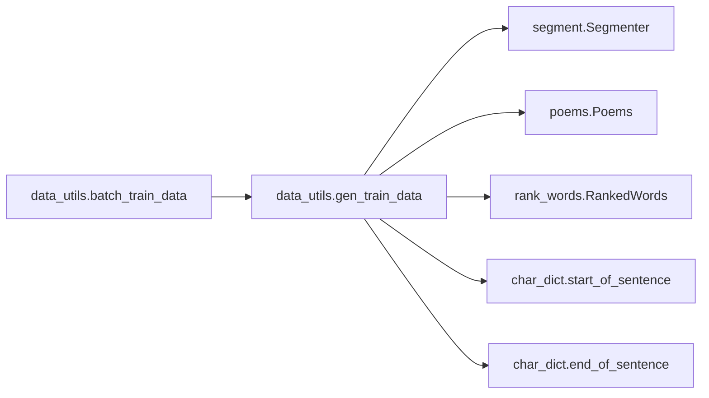
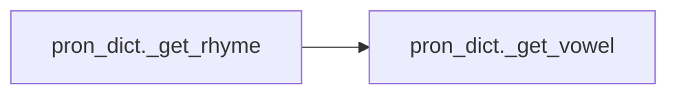
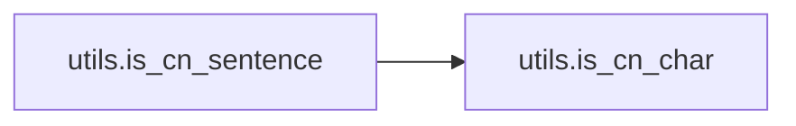
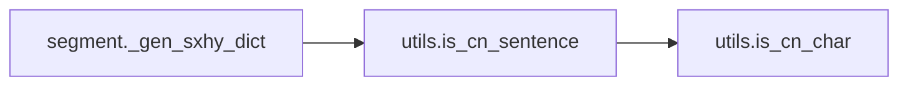
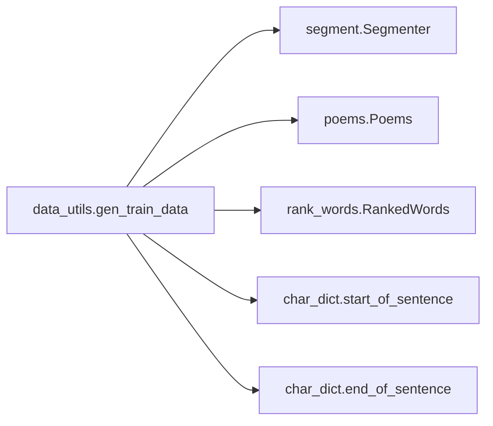
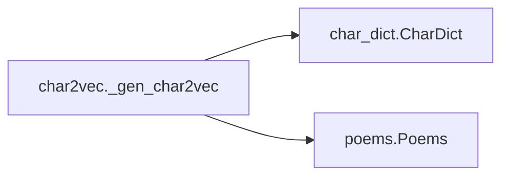
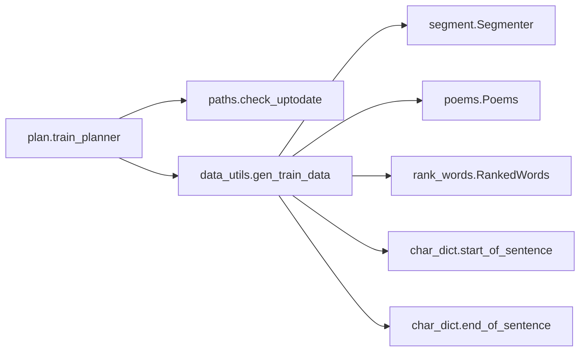
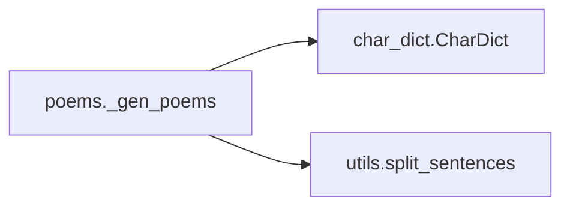

# Key Objects

[_Documentation generated by Documatic_](https://www.documatic.com)

<!---Documatic-section-utils.split_sentences-start--->
## utils.split_sentences

<!---Documatic-section-split_sentences-start--->
<!---Documatic-block-utils.split_sentences-start--->
<details>
	<summary><code>utils.split_sentences</code> code snippet</summary>

```python
def split_sentences(text):
    sentences = []
    i = 0
    for j in range(len(text) + 1):
        if j == len(text) or text[j] in [u'，', u'。', u'！', u'？', u'、', u'\n']:
            if i < j:
                sentence = u''.join(filter(is_cn_char, text[i:j]))
                sentences.append(sentence)
            i = j + 1
    return sentences
```
</details>
<!---Documatic-block-utils.split_sentences-end--->
<!---Documatic-section-split_sentences-end--->

# #
<!---Documatic-section-utils.split_sentences-end--->

<!---Documatic-section-char_dict.start_of_sentence-start--->
## char_dict.start_of_sentence

<!---Documatic-section-start_of_sentence-start--->
<!---Documatic-block-char_dict.start_of_sentence-start--->
<details>
	<summary><code>char_dict.start_of_sentence</code> code snippet</summary>

```python
def start_of_sentence():
    return '^'
```
</details>
<!---Documatic-block-char_dict.start_of_sentence-end--->
<!---Documatic-section-start_of_sentence-end--->

# #
<!---Documatic-section-char_dict.start_of_sentence-end--->

<!---Documatic-section-data_utils.batch_train_data-start--->
## data_utils.batch_train_data

<!---Documatic-section-batch_train_data-start--->


### Object Calls

* data_utils.gen_train_data

<!---Documatic-block-data_utils.batch_train_data-start--->
<details>
	<summary><code>data_utils.batch_train_data</code> code snippet</summary>

```python
def batch_train_data(batch_size):
    gen_train_data()
    keywords = []
    contexts = []
    sentences = []
    with open(gen_data_path, 'r') as fin:
        for line in fin.readlines():
            toks = line.strip().split('\t')
            sentences.append(toks[0])
            keywords.append(toks[1])
            contexts.append(toks[2])
            if len(keywords) == batch_size:
                yield (keywords, contexts, sentences)
                keywords.clear()
                contexts.clear()
                sentences.clear()
```
</details>
<!---Documatic-block-data_utils.batch_train_data-end--->
<!---Documatic-section-batch_train_data-end--->

# #
<!---Documatic-section-data_utils.batch_train_data-end--->

<!---Documatic-section-rank_words._get_stopwords-start--->
## rank_words._get_stopwords

<!---Documatic-section-_get_stopwords-start--->
<!---Documatic-block-rank_words._get_stopwords-start--->
<details>
	<summary><code>rank_words._get_stopwords</code> code snippet</summary>

```python
def _get_stopwords():
    stopwords = set()
    with open(_stopwords_path, 'r') as fin:
        for line in fin.readlines():
            stopwords.add(line.strip())
    return stopwords
```
</details>
<!---Documatic-block-rank_words._get_stopwords-end--->
<!---Documatic-section-_get_stopwords-end--->

# #
<!---Documatic-section-rank_words._get_stopwords-end--->

<!---Documatic-section-pron_dict._get_rhyme-start--->
## pron_dict._get_rhyme

<!---Documatic-section-_get_rhyme-start--->


### Object Calls

* pron_dict._get_vowel

<!---Documatic-block-pron_dict._get_rhyme-start--->
<details>
	<summary><code>pron_dict._get_rhyme</code> code snippet</summary>

```python
def _get_rhyme(pinyin):
    vowel = _get_vowel(pinyin)
    if vowel in ['A', 'IA', 'UA']:
        return 1
    elif vowel in ['O', 'E', 'UO']:
        return 2
    elif vowel in ['IE', 'VE']:
        return 3
    elif vowel in ['AI', 'UAI']:
        return 4
    elif vowel in ['EI', 'UI']:
        return 5
    elif vowel in ['AO', 'IAO']:
        return 6
    elif vowel in ['OU', 'IU']:
        return 7
    elif vowel in ['AN', 'IAN', 'UAN', 'VAN']:
        return 8
    elif vowel in ['EN', 'IN', 'UN', 'VN']:
        return 9
    elif vowel in ['ANG', 'IANG', 'UANG']:
        return 10
    elif vowel in ['ENG', 'ING']:
        return 11
    elif vowel in ['ONG', 'IONG']:
        return 12
    elif vowel == 'I' and (not pinyin[0] in ['Z', 'C', 'S', 'R']) or vowel == 'V':
        return 13
    elif vowel == 'I':
        return 14
    elif vowel == 'U':
        return 15
    return 0
```
</details>
<!---Documatic-block-pron_dict._get_rhyme-end--->
<!---Documatic-section-_get_rhyme-end--->

# #
<!---Documatic-section-pron_dict._get_rhyme-end--->

<!---Documatic-section-utils.is_cn_sentence-start--->
## utils.is_cn_sentence

<!---Documatic-section-is_cn_sentence-start--->


### Object Calls

* utils.is_cn_char

<!---Documatic-block-utils.is_cn_sentence-start--->
<details>
	<summary><code>utils.is_cn_sentence</code> code snippet</summary>

```python
def is_cn_sentence(sentence):
    for ch in sentence:
        if not is_cn_char(ch):
            return False
    return True
```
</details>
<!---Documatic-block-utils.is_cn_sentence-end--->
<!---Documatic-section-is_cn_sentence-end--->

# #
<!---Documatic-section-utils.is_cn_sentence-end--->

<!---Documatic-section-segment._gen_sxhy_dict-start--->
## segment._gen_sxhy_dict

<!---Documatic-section-_gen_sxhy_dict-start--->


### Object Calls

* utils.is_cn_sentence

<!---Documatic-block-segment._gen_sxhy_dict-start--->
<details>
	<summary><code>segment._gen_sxhy_dict</code> code snippet</summary>

```python
def _gen_sxhy_dict():
    print('Parsing shixuehanying dictionary ...')
    words = set()
    with open(_rawsxhy_path, 'r') as fin:
        for line in fin.readlines():
            if line[0] == '<':
                continue
            for phrase in line.strip().split()[1:]:
                if not is_cn_sentence(phrase):
                    continue
                idx = 0
                while idx + 4 <= len(phrase):
                    words.add(phrase[idx:idx + 2])
                    idx += 2
                if idx < len(phrase):
                    for word in jieba.lcut(phrase[idx:]):
                        words.add(word)
    with open(sxhy_path, 'w') as fout:
        fout.write(' '.join(words))
```
</details>
<!---Documatic-block-segment._gen_sxhy_dict-end--->
<!---Documatic-section-_gen_sxhy_dict-end--->

# #
<!---Documatic-section-segment._gen_sxhy_dict-end--->

<!---Documatic-section-utils.is_cn_char-start--->
## utils.is_cn_char

<!---Documatic-section-is_cn_char-start--->
<!---Documatic-block-utils.is_cn_char-start--->
<details>
	<summary><code>utils.is_cn_char</code> code snippet</summary>

```python
def is_cn_char(ch):
    return ch >= u'一' and ch <= u'龥'
```
</details>
<!---Documatic-block-utils.is_cn_char-end--->
<!---Documatic-section-is_cn_char-end--->

# #
<!---Documatic-section-utils.is_cn_char-end--->

<!---Documatic-section-char_dict._gen_char_dict-start--->
## char_dict._gen_char_dict

<!---Documatic-section-_gen_char_dict-start--->
<!---Documatic-block-char_dict._gen_char_dict-start--->
<details>
	<summary><code>char_dict._gen_char_dict</code> code snippet</summary>

```python
def _gen_char_dict():
    print('Generating dictionary from corpus ...')
    char_cnts = dict()
    for corpus in _corpus_list:
        with open(os.path.join(raw_dir, corpus), 'r') as fin:
            for ch in filter(is_cn_char, fin.read()):
                if ch not in char_cnts:
                    char_cnts[ch] = 1
                else:
                    char_cnts[ch] += 1
    cnt2char = sorted(char_cnts.items(), key=lambda x: -x[1])
    with open(char_dict_path, 'w') as fout:
        for i in range(min(MAX_DICT_SIZE - 2, len(cnt2char))):
            fout.write(cnt2char[i][0])
```
</details>
<!---Documatic-block-char_dict._gen_char_dict-end--->
<!---Documatic-section-_gen_char_dict-end--->

# #
<!---Documatic-section-char_dict._gen_char_dict-end--->

<!---Documatic-section-data_utils.gen_train_data-start--->
## data_utils.gen_train_data

<!---Documatic-section-gen_train_data-start--->


### Object Calls

* segment.Segmenter
* poems.Poems
* rank_words.RankedWords
* char_dict.start_of_sentence
* char_dict.end_of_sentence

<!---Documatic-block-data_utils.gen_train_data-start--->
<details>
	<summary><code>data_utils.gen_train_data</code> code snippet</summary>

```python
def gen_train_data():
    print('Generating training data ...')
    segmenter = Segmenter()
    poems = Poems()
    poems.shuffle()
    ranked_words = RankedWords()
    plan_data = []
    gen_data = []
    for poem in poems:
        if len(poem) != 4:
            continue
        valid = True
        context = start_of_sentence()
        gen_lines = []
        keywords = []
        for sentence in poem:
            if len(sentence) != 7:
                valid = False
                break
            words = list(filter(lambda seg: seg in ranked_words, segmenter.segment(sentence)))
            if len(words) == 0:
                valid = False
                break
            keyword = words[0]
            for word in words[1:]:
                if ranked_words.get_rank(word) < ranked_words.get_rank(keyword):
                    keyword = word
            gen_line = sentence + end_of_sentence() + '\t' + keyword + '\t' + context + '\n'
            gen_lines.append(gen_line)
            keywords.append(keyword)
            context += sentence + end_of_sentence()
        if valid:
            plan_data.append('\t'.join(keywords) + '\n')
            gen_data.extend(gen_lines)
    with open(plan_data_path, 'w') as fout:
        for line in plan_data:
            fout.write(line)
    with open(gen_data_path, 'w') as fout:
        for line in gen_data:
            fout.write(line)
```
</details>
<!---Documatic-block-data_utils.gen_train_data-end--->
<!---Documatic-section-gen_train_data-end--->

# #
<!---Documatic-section-data_utils.gen_train_data-end--->

<!---Documatic-section-pron_dict._get_vowel-start--->
## pron_dict._get_vowel

<!---Documatic-section-_get_vowel-start--->
<!---Documatic-block-pron_dict._get_vowel-start--->
<details>
	<summary><code>pron_dict._get_vowel</code> code snippet</summary>

```python
def _get_vowel(pinyin):
    i = len(pinyin) - 1
    while i >= 0 and pinyin[i] in ['A', 'O', 'E', 'I', 'U', 'V']:
        i -= 1
    return pinyin[i + 1:]
```
</details>
<!---Documatic-block-pron_dict._get_vowel-end--->
<!---Documatic-section-_get_vowel-end--->

# #
<!---Documatic-section-pron_dict._get_vowel-end--->

<!---Documatic-section-char2vec._gen_char2vec-start--->
## char2vec._gen_char2vec

<!---Documatic-section-_gen_char2vec-start--->


### Object Calls

* char_dict.CharDict
* poems.Poems

<!---Documatic-block-char2vec._gen_char2vec-start--->
<details>
	<summary><code>char2vec._gen_char2vec</code> code snippet</summary>

```python
def _gen_char2vec():
    print('Generating char2vec model ...')
    char_dict = CharDict()
    poems = Poems()
    model = models.Word2Vec(poems, size=CHAR_VEC_DIM, min_count=5)
    embedding = uniform(-1.0, 1.0, [len(char_dict), CHAR_VEC_DIM])
    for (i, ch) in enumerate(char_dict):
        if ch in model.wv:
            embedding[i, :] = model.wv[ch]
    np.save(char2vec_path, embedding)
```
</details>
<!---Documatic-block-char2vec._gen_char2vec-end--->
<!---Documatic-section-_gen_char2vec-end--->

# #
<!---Documatic-section-char2vec._gen_char2vec-end--->

<!---Documatic-section-plan.train_planner-start--->
## plan.train_planner

<!---Documatic-section-train_planner-start--->


### Object Calls

* paths.check_uptodate
* data_utils.gen_train_data

<!---Documatic-block-plan.train_planner-start--->
<details>
	<summary><code>plan.train_planner</code> code snippet</summary>

```python
def train_planner():
    print('Training Word2Vec-based planner ...')
    if not os.path.exists(save_dir):
        os.mkdir(save_dir)
    if not check_uptodate(plan_data_path):
        gen_train_data()
    word_lists = []
    with open(plan_data_path, 'r') as fin:
        for line in fin.readlines():
            word_lists.append(line.strip().split('\t'))
    model = models.Word2Vec(word_lists, size=512, min_count=5)
    model.save(_plan_model_path)
```
</details>
<!---Documatic-block-plan.train_planner-end--->
<!---Documatic-section-train_planner-end--->

# #
<!---Documatic-section-plan.train_planner-end--->

<!---Documatic-section-poems._gen_poems-start--->
## poems._gen_poems

<!---Documatic-section-_gen_poems-start--->


### Object Calls

* char_dict.CharDict
* utils.split_sentences

<!---Documatic-block-poems._gen_poems-start--->
<details>
	<summary><code>poems._gen_poems</code> code snippet</summary>

```python
def _gen_poems():
    print('Parsing poems ...')
    char_dict = CharDict()
    with open(poems_path, 'w') as fout:
        for corpus in _corpus_list:
            with open(os.path.join(raw_dir, corpus), 'r') as fin:
                for line in fin.readlines()[1:]:
                    sentences = split_sentences(line.strip().split()[-1])
                    all_char_in_dict = True
                    for sentence in sentences:
                        for ch in sentence:
                            if char_dict.char2int(ch) < 0:
                                all_char_in_dict = False
                                break
                        if not all_char_in_dict:
                            break
                    if all_char_in_dict:
                        fout.write(' '.join(sentences) + '\n')
            print('Finished parsing %s.' % corpus)
```
</details>
<!---Documatic-block-poems._gen_poems-end--->
<!---Documatic-section-_gen_poems-end--->

# #
<!---Documatic-section-poems._gen_poems-end--->

<!---Documatic-section-char_dict.end_of_sentence-start--->
## char_dict.end_of_sentence

<!---Documatic-section-end_of_sentence-start--->
<!---Documatic-block-char_dict.end_of_sentence-start--->
<details>
	<summary><code>char_dict.end_of_sentence</code> code snippet</summary>

```python
def end_of_sentence():
    return '$'
```
</details>
<!---Documatic-block-char_dict.end_of_sentence-end--->
<!---Documatic-section-end_of_sentence-end--->

# #
<!---Documatic-section-char_dict.end_of_sentence-end--->

<!---Documatic-section-paths.check_uptodate-start--->
## paths.check_uptodate

<!---Documatic-section-check_uptodate-start--->
<!---Documatic-block-paths.check_uptodate-start--->
<details>
	<summary><code>paths.check_uptodate</code> code snippet</summary>

```python
def check_uptodate(path):
    if not os.path.exists(path):
        return False
    timestamp = os.path.getmtime(path)
    if path in _dependency_dict:
        for dependency in _dependency_dict[path]:
            if not os.path.exists(dependency) or os.path.getmtime(dependency) > timestamp:
                return False
    return True
```
</details>
<!---Documatic-block-paths.check_uptodate-end--->
<!---Documatic-section-check_uptodate-end--->

# #
<!---Documatic-section-paths.check_uptodate-end--->

[_Documentation generated by Documatic_](https://www.documatic.com)